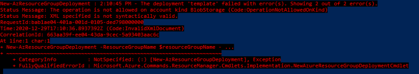
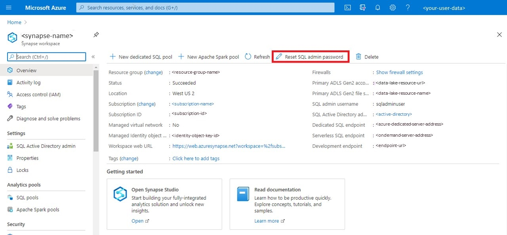

## Overview

This sample project demonstrates how and where to use some data engineering Azure tools:

- Azure Databricks
- Azure Synapse

We achieve our goal with an example:

> _Use Case:_ The objective is to identify the impact of different factors in the COVID-19 pandemic evolution and how its evolution is reflected in social networks, in this case Twitter. For this purpose, we collected, via public APIs, daily information on incoming flights, weather temperatures, traffic and mobility data, also tweets with the tag #covid and, of course, data on the pandemic spread (new cases and demises). All this for 5 main countries: Japan, Spain, France, United States and Brazil.

Also, we presented two applications which demonstrate how to embed Power BI reports in two scenarios according the data
flow and user credentials:

1. **application-own-data**: This application embeds Power BI reports for customers, using Azure AD B2C authentication.
2. **user-own-data**: This application embeds Power BI reports for the organization, using Azure AD B2B authentication.

### Architecture

The architectural design of the current project, once is fully deployed, is as follows:


<p>
<br/>
<br/>
</p>

## Contents

[Requirements](#requirements)

[Folder structure](#folder-structure)

[How to Deploy ARM templates](#how-to-deploy-arm-templates)

[Data Lake Storage Account](#data-lake-storage-account)

[Others storage support accounts](#others-storage-support-accounts)

[Synapse Workspace deployment](#synapse-workspace-deployment)

[Data Factory deployment](#data-factory-deployment)

[Databricks Workspace deployment](#databricks-workspace-deployment)

[Power BI](#power-bi)

[App Service Plan](#app-service-plan)

[Azure Functions](#azure-functions)

[Contributing](#contributing)

[License](#license)

<p>
<br/>
<br/>
</p>

## Requirements

In order to test our solution, you will need the following:

1. An active Azure subscription.
2. A Power BI Pro or Premium subscription (recommended Administrator rights over the Workspace).
3. (Optional) [Power BI for desktop](https://powerbi.microsoft.com/en-us/downloads/) can be a great addition if you want to edit reports.
4. [NodeJS and npm](https://nodejs.org/en/) (necessary to install the packages of the applications).
5. (Optional) An IDE can be handy, we recommend [VS Code](https://code.visualstudio.com/download).
6. (Optional) An SQL Server client, we recommend [SQL Server Management Studio](https://docs.microsoft.com/en-us/sql/ssms/download-sql-server-management-studio-ssms?view=sql-server-ver15) to work with Synapse Workspace.
7. OpenSky subscription with API access key (all the API that we used are free, but for OpenSky you will need to register in the **[web](https://opensky-network.org/)** to get an access key).

> _Note:_ Each individual application presented can need extra requirements. Those requirements will be listed in the README of each application.

<p>
<br/>
<br/>
</p>

## Folder structure

```
(root)
    ├─── deployment-templates
    |   ├── app-service
    |   ├── data-factory
    |   |   ├── factory
    |   |   └── linkedTemplates
    |   ├── power-bi
    |   ├── service-plan
    |   ├── storage-accounts
    |   |   ├── data-lake
    |   |   └── static-deployment-storage
    |   ├── synapse-workspace
    |   └── databricks-workspace
    └─── embed-report-applications
        ├── embed-for-customers
        └── embed-for-organization
```

- deployment-templates:
  - app-service: Contains the template to recreate the Web Application Service which is used to publish the embeding report application (embed for customers).
  - data-factory: Contains the required templates to recreate a Data Factory resource with all its Pipelines and Datasets.
  - power-bi: Contains the required templates to recreate a Power BI embedding resource.
  - service-plan: Contains the required templates to recreate the service plan which is attached to the app service, and the Azure Function.
  - storage-accounts:
    - data-lake: Contains the required templates to recreate the Data Lake storage (the containers are not included).
    - static-deployment-storage: Contains the required templates to recreate the classic Storage Account used to statically publish the embedding report application (embed for organization).
  - synapse-workspace: Contains the required templates to recreate a Synapse workspace also, the SQL script to create the Data Base structure used.
  - synapse-workspace: Contains the required templates to recreate a Databrikcs workspace also, the Python code to write in the Notebooks.
- embed-report-applications
  - embed-for-customers : Contains source code of an application (ReactJS-TypeScript + .NET Core 3.1 Web API-C#) which embed Power BI reports in a app-own-data application scenario.
  - embed-for-organization : Contains source code of an application (ReactJS-JavaScript) which embed Power BI reports in a user-own-data application scenario.

<p>
<br/>
<br/>
</p>

## How to Deploy ARM templates

There are several ways to load the Azure ARM templates:

1. [Azure Portal](https://docs.microsoft.com/en-us/azure/azure-resource-manager/templates/deploy-portal),
2. [Azure CLI](https://docs.microsoft.com/en-us/azure/azure-resource-manager/templates/deploy-cli),
3. [ARM REST API](https://docs.microsoft.com/en-us/azure/azure-resource-manager/templates/deploy-rest),
4. [GitHub](https://docs.microsoft.com/en-us/azure/azure-resource-manager/templates/deploy-to-azure-button),
5. [Azure Cloud Shell](https://docs.microsoft.com/en-us/azure/azure-resource-manager/templates/deploy-cloud-shell)
6. [PowerShell with cmdlets](https://docs.microsoft.com/en-us/powershell/azure/get-started-azureps).

We prefer to use **PowerShell with cmdlets** so, we will show how to, using this method.

To deploy ARM templates you need to install Azure PowerShell cmdlets on your local computer.

> _Note:_ If you don't have PowerShell installed, you can use Azure Cloud Shell. For more information, see [Deploy ARM templates from Azure Cloud Shell](https://docs.microsoft.com/en-us/azure/azure-resource-manager/templates/deploy-cloud-shell).

The following step-by-step commands are minimum required to deploy through Powershell. Copy and paste the following commands in order in your Powershell console and fill in the necessary information according to your Azure subscription.

1. Connect to your Azure account, credentials will be asked in a emergent window.

   ```bash
   Connect-AzAccount
   ```

2. List your subscriptions (in case you have more than one) to help you to select the right one.

   ```bash
   Get-AzSubscription
   ```

3. Select the proper subscription to work.

   ```bash
   Set-AzContext -SubscriptionName "<subscription name>"
   ```

4. Check the current subscription, must be the same that the selected in the previous step.

   ```bash
   Get-AzContext
   ```

5. Define some useful variables to work in posterior steps.

   ```bash
   $resourceGroupName = Read-Host -Prompt "Enter the Resource Group name"
   $location = Read-Host -Prompt "Enter the location (i.e. westus2)"
   ```

6. Deploy template. Browse to the desired resourse folder to load, inside [deployment-templates] folder, and run the following command.

   ```bash
   New-AzResourceGroupDeployment -ResourceGroupName $resourceGroupName -TemplateFile template-<resource-name>.json
   ```

<p>
<br/>
<br/>
</p>

## Data Lake Storage Account

The Data Lake Storage template only create the resource in your Resource Group. Once deployed the template you must proceed to create and configure the required Containers (for a better understanding on Data Lake Storage Gen2, please read the [official documents](https://docs.microsoft.com/en-us/azure/storage/blobs/data-lake-storage-introduction)). For this project, the steps are as follows:

### Deploy ARM template

Browse to the **[deployment-templates/storage-accounts/data-lake](deployment-templates/storage-accounts/data-lake)** folder and in the **[template-data-lake.json](deployment-templates/storage-accounts/data-lake/template-data-lake.json)** template file replace the default values of the parameters with the values of your election.

```json
"datalake_storage_name": {
    "defaultValue": "<storage-name>",
    "type": "String"
},
"synapse_store_container_name": {
    "defaultValue": "<synapse-store-name>",
    "type": "String"
}
```

| Parameter                    | Description                                                                                                                                                  |
| ---------------------------- | ------------------------------------------------------------------------------------------------------------------------------------------------------------ |
| datalake_storage_name        | Replace defaultValue: **\<storage-name\>** with your preferred Data Lake storage resource name.                                                              |
| synapse_store_container_name | Replace defaultValue: **\<synapse-store-name\>** with the name of the container which will be used as store for your Synapse databases (in serverless mode). |

To know how to deploy an ARM template in Azure refer to the section [How to Deploy ARM templates](#how-to-deploy-arm-templates). Using PowerShell to deploy the template (as we recommend) the command will be the following:

```bash
New-AzResourceGroupDeployment -ResourceGroupName $resourceGroupName -TemplateFile template-data-lake.json
```

> _Note:_ When deploying this template, you might get the following error, related with a bug mentioned in the [GitHub](https://github.com/Azure/azure-cli/issues/10700) issue and refers to the fact that, at the time of writing this, the creation of hierarchical resources is not supported by Azure.
> 

### Create Containers

Until now, Azure does not support creating hierarchical resources when deploying an ARM template. Therefore, if you do not receive an error related to creating hierarchical resources when deploying the template, check if the necessary containers have been created in your Data Lake. In case that the containers are not in your Data Lake you must create them by hand.

We recommend create the following containers to organize the information.

| Name                   | Description                                                                                    |
| ---------------------- | ---------------------------------------------------------------------------------------------- |
| covid                  | Stores COVID-19 data.                                                                          |
| \<synapse-store-name\> | Synapse Workspace internal store, replace **\<synapse-store-name\>** with your preferred name. |
| mobilitydata           | Stores Mobility processed data.                                                                |
| openskyarrivals        | Stores flight arrivals data.                                                                   |
| reports                | Stores Data Bricks Processed reports.                                                          |
| weatherdata            | Stores weather data.                                                                           |

> _Note:_ These containers will be used later in this guide by other resources so, keep in mind any change in the containers structure proposed because it may affect other services.

<p>
<br/>
<br/>
</p>

## Others storage support accounts

This ARM template creates 2 standard Azure Storage Accounts for other general purposes.

### Deploy ARM template:

Browse to the **[deployment-templates/storage-accounts/static-deployment-storage](deployment-templates/storage-accounts/static-deployment-storage)** folder and in the **[template-storage-account.json](deployment-templates/storage-accounts/static-deployment-storage/template-storage-account.json)** template file replace the default values of the parameters with the values of your election.

``` json
"customlogin_storage_name": {
    "defaultValue": "<storage-name>",
    "type": "String"
},
"sttemptmp_storage_name": {
    "defaultValue": "<storage-name>",
    "type": "String"
}
```

| Parameter	                          | Description 	                                                                            |
|-------------------------------------|-------------------------------------------------------------------------------------------- |
| customlogin_storage_name            | Replace defaultValue: **\<storage-name\>** with your preferred Storage Account name.      	|
| sttemptmp_storage_name  	          | Replace defaultValue: **\<storage-name\>** with your preferred Storage Account name.    	|

To know how to deploy an ARM template in Azure refer to the section [How to Deploy ARM templates](#how-to-deploy-arm-templates). Using PowerShell to deploy the template (as we recommend) the command will be the following:

``` bash
New-AzResourceGroupDeployment -ResourceGroupName $resourceGroupName -TemplateFile template-storage-account.json
```

>_Note:_ You may get an error like this, even so the resources were created correctly.
>

### Create Containers

Until now, Azure does not support creating hierarchical resources when deploying an ARM template. Therefore, if you do not receive an error related to creating hierarchical resources when deploying the template, check if the necessary containers have been created in your Data Lake. In case that the containers are not in your Data Lake you must create them by hand.

We recommend create the following containers to organize the information:

**\<customlogin\>**

| Name | Description                           |
| ---- | ------------------------------------- |
| root | Stores custom files for social login. |

**\<sttemptmp\>**

| Name                | Description                                       |
| ------------------- | ------------------------------------------------- |
| twitterdataraw      | Stores raw twitter data.                          |
| twitterdatatemp     | Temporary storage used by Twitter Azure Function. |
| twitterfunctionlogs | Stores twitter function logs.                     |
| webapp-internal     | Stores B2B Web App Files.                         |
| webapp-report       | Stores B2C Web App Files.                         |

> _Note:_ These containers will be used later in this guide by other resources so, keep in mind any change in the containers structure proposed because it may affect other services.

<p>
<br/>
<br/>
</p>

## Synapse Workspace deployment

The Synapse template only create the resource in your Resource Group. Once deployed the template you must proceed to create and configure the required Database (for a better understanding on Data Lake Storage Gen2, please read the [official documents](https://docs.microsoft.com/en-us/azure/storage/blobs/data-lake-storage-introduction)). For this project, the steps are as follows:

### Deploy ARM template

Browse to the **[deployment-templates/synapse-workspace](deployment-templates/synapse-workspace)** folder and in the **[template-synapse-workspace.json](deployment-templates/synapse-workspace/template-synapse-workspace.json)** template file replace the default values of the parameters with the values of your election.

```json
"workspaces_saw_name": {
    "defaultValue": "<workspace-name>",
    "type": "String"
},
"resource_group_name": {
    "defaultValue": "<resource-group-name>",
    "type": "String"
},
"data_lake_base_storage_name": {
    "defaultValue": "<synapse-store-name>",
    "type": "String"
}
```

| Parameter                   | Description                                                                                                                                                                         |
| --------------------------- | ----------------------------------------------------------------------------------------------------------------------------------------------------------------------------------- |
| workspaces_saw_name         | Replace defaultValue: **\<workspace-name\>** with your preferred Synapse Workspace name.                                                                                            |
| resource_group_name         | Replace defaultValue: **\<resource-group-name\>** with the name of your Resource Group previusly created.                                                                           |
| data_lake_base_storage_name | Replace defaultValue: **\<synapse-store-name\>** with your Data Lake container for Synapse Workspace internal store created previusly in the section [Data Lake Storage Account](#data-lake-storage-account) of this document. |

To know how to deploy an ARM template in Azure refer to the section [How to Deploy ARM templates](#how-to-deploy-arm-templates). Using PowerShell to deploy the template (as we recommend) the command will be the following:

```bash
New-AzResourceGroupDeployment -ResourceGroupName $resourceGroupName -TemplateFile template-synapse-workspace.json
```

### Connect to the Database

At this point, the Synapse resource should be properly provisioned.
To connect to the database (serverless), via Azure Portal or SQL client, you must follow the following steps:

1. Reset SQL admin password:

    Go to the Synapse Workspace resource, in the "Overview" section you will find an option to reset the SQL admin password.

    

2. Add your current IP to the firewall:

    Go to the Synapse Workspace resource, in the "Security/Firewall" section you can add your client IP.

    

### SQL Server client

Now, you can connect to the Synapse serverless database via any SQL server client, by example [SQL Server Management Studio](https://docs.microsoft.com/en-us/sql/ssms/download-sql-server-management-studio-ssms?view=sql-server-ver15), or Azure Portal.


If you use SQL Server Management Studio please connect SSMS with your serverless database pool.


### Data linking

In this repository we included the necessary [scripts](deployment-templates/synapse-workspace/serverless-data-creation.sql) to build the tables and views that we used in this project, however, these scripts must be reviewed in detail before being executed according to the structure, fields and properties of the files to query.
In almost all cases, we used CSV (Comma Separated Values) to store data from external APIs; see the [Data Factory](#data-factory) section for more information.
Next, we will briefly explain how to link Data Lake Storage into a table in Synapse. To execute these commands, we use [SQL Server Management Studio](https://docs.microsoft.com/en-us/sql/ssms/download-sql-server-management-studio-ssms?view=sql-server-ver15), but you can use any SQL Server client

1. Master key encryption.

    ``` sql
    CREATE MASTER KEY ENCRYPTION BY PASSWORD = '<your super strong password>';
    ```
2. Database scoped credential:

    - Create and copy a new Shared Access Signature in your Data Lake Storage account.

    

    ```sql
    CREATE DATABASE SCOPED CREDENTIAL <storageaccountSAS> WITH IDENTITY = 'SHARED ACCESS SIGNATURE', SECRET = '?sv=<shared access signature>';
    ```

3. Create a secured data source.

   ```sql
   CREATE EXTERNAL DATA SOURCE [<SecuredDataSource>] WITH (
   LOCATION = 'https://<data lake storage name>.blob.core.windows.net',
   CREDENTIAL = [<storageaccountSAS>]);
   ```

4. Create file formats:

    - CSV with no headers.

    ```sql
    CREATE EXTERNAL FILE FORMAT [<CsvNoHeaderFileFormat>] WITH (
        FORMAT_TYPE = DELIMITEDTEXT,
        FORMAT_OPTIONS (FIELD_TERMINATOR = N',', STRING_DELIMITER = N'"', USE_TYPE_DEFAULT = False)
    );
    ```

    - CSV with headers.

    ```sql
    CREATE EXTERNAL FILE FORMAT [<CsvFileFormat>] WITH (
        FORMAT_TYPE = DELIMITEDTEXT,
        FORMAT_OPTIONS (FIELD_TERMINATOR = N',',
        STRING_DELIMITER = N'"',
        FIRST_ROW = 2, USE_TYPE_DEFAULT = False)
    )
    ```

5. Create tables:

    At the time of writing this document, Synapse Serverless database does not support flat tables, we use Synapse's ability to query data directly from Data Lake Gen2 ([External Tables](https://docs.microsoft.com/en-us/azure/synapse-analytics/sql/develop-tables-external-tables?tabs=sql-on-demand)), to apply data transformations we used [CETAS](https://docs.microsoft.com/en-us/azure/synapse-analytics/sql/develop-tables-cetas) (CREATE EXTERNAL TABLE AS SELECT) in our SQL serverless pool for performance reasons.

    As an example, we explained how to create an EXTERNAL table and a CETAS, the rest of the tables are in the script [serverless-data-creation.sql](/Repo/deployment-templates/synapse-workspace/serverless-data-creation.sql).

    ```sql
    CREATE EXTERNAL TABLE [dbo].[covid_history]
    (
        [date_rep] varchar(10)
        ,[day] int
        ,[month] int
        ,[year] int
        ,[cases] bigint
        ,[deaths] bigint
        ,[countries_and_territories] varchar(100)
        ,[geo_id] varchar(100)
        ,[country_territory_code] varchar(50)
        ,[pop_data_2018] bigint
        ,[continent_exp] varchar(50)
        ,[comulative14] float
    ) WITH (
        DATA_SOURCE = [<SecuredDataSource>],
        LOCATION = '/covid/csv',
        FILE_FORMAT = [<CsvFileFormat>])
    ```

    CETAS

    ```sql
    CREATE EXTERNAL TABLE [dbo].[mobility_plain]
    WITH (
        DATA_SOURCE = [<SecuredDataSource>],
        LOCATION = '/mobilitydata/mobility_plain',
        FILE_FORMAT = [<CsvNoHeaderFileFormat>])
    AS
    SELECT  FORMAT(cast(SUBSTRING ( M.CREATED_TIMESTAMP ,1 , 10 )  as date), 'yyyy-MM-dd') created
    , C.ISO
    , AVG(CAST(LTRIM(RTRIM(M.JF)) as FLOAT)) jam_factor
    FROM [dbo].[mobility] M
    INNER JOIN [dbo].[countries] C ON C.EBU_COUNTRY_CODE = M.EBU_COUNTRY_CODE AND C.EXTENDED_COUNTRY_CODE = M.EXTENDED_COUNTRY_CODE
    GROUP BY FORMAT(cast(SUBSTRING ( M.CREATED_TIMESTAMP ,1 , 10 )  as date), 'yyyy-MM-dd'), C.ISO
    ```

After running the rest of the scripts, you should have obtained a similar structure to this in your database:


<p>
<br/>
<br/>
</p>

## Data Factory deployment

Azure Data Factory is Azure's cloud ETL service for scale-out serverless data integration and data transformation.
It offers a code-free UI for intuitive authoring and single-pane-of-glass monitoring and management. You can also lift
and shift existing SSIS packages to Azure and run them with full compatibility in ADF. SSIS Integration Runtime offers
a fully managed service, so you don't have to worry about infrastructure management. If you want to learn more about
Azure Data Factory browse to the [official documents](https://docs.microsoft.com/en-us/azure/data-factory/)

### Deploy ARM template

1. First, you need to create an empty Data Factory clicking inside your Resource Group at the icon "+".

    

2. Following select "Data Factory" and "Create".

    

3. In the form "Create Data Factory" > "Basics" step validate your subscription and Resource Group, select the "Region",
   name your Data Factory resource and press on "Next: Git configuration" button.

    

4. In the form "Create Data Factory" > "Git configuration" step, check the "Configure Git later" checkbox (if you want, you can perform this configuration using your Git or DevOps account) and press on "Review + create" button. You can manage the rest of the steps according your needs, but we leave them by default.

    

5. In the form "Create Data Factory" > "Review + create" step Azure will perform a validation, once this validation was passed press on "Create" button.

    

6. Once created your Data Factory, return to your Resource Group and browse into the Data Factory resource and select "Author & Monitor" feature in the main panel.

    

7. Inside this feature select the "Author" (`pencil icon`) option on the left side menu.

    

8. Select, from the top toolbox, the option "ARM template" \> "Import ARM template".

    

6. Once in the "Custom deployment" form, select the option "Build your own template in the editor".

    

7. Select the option "Load file" and select the main template file **[deployment-templates/data-factory/template-data-factory.json](deployment-templates/data-factory/template-data-factory.json)**.

### Configure the template

Once loaded the template in the "Edit template" form you must set your own configurations parameters:

1. Set "factoryName" default value, replace "\<your-data-factory-name\>" with your Data Factory name.

   ```json
   "factoryName": {
       "type": "string",
       "metadata": "Data Factory name",
       "defaultValue": "<your-data-factory-name>"
   }
   ```

2. Set "DataLakeStorage_accountKey" default value, replace "\<your-datalake-storage-account-key\>" with your Data Lake Storage Access key.
   ```json
   "DataLakeStorage_accountKey": {
       "type": "secureString",
       "metadata": "Secure string for 'accountKey' of 'DataLakeStorage'",
       "defaultValue": "<your-datalake-storage-account-key>"
   }
   ```

   > _Note:_ Your Data Lake Storage Access key can be found in the "Access key" section of your Data Lake Storage resource.
   > 

3. Set "DataLakeStorage_properties_typeProperties_url" default value, replace "\<your-datalake-storage\>" with your Data Lake Storage url.
   ```json
   "DataLakeStorage_properties_typeProperties_url": {
       "type": "string",
       "defaultValue": "<your-datalake-storage>"
   },
   ```

   > _Note:_ Your Data Lake Storage url can be found in the "Properties" section of your Data Lake Storage resource.
   > 

4. Set "OpenSkyArrivalsLiveAPI_properties_typeProperties_url" default value, replace "\<your-opensky-base-url-with-key\>" by the OpenSky provided URL to access their API.
   ```json
   "OpenSkyArrivalsLiveAPI_properties_typeProperties_url": {
       "type": "string",
       "defaultValue": "<your-opensky-base-url-with-key>/api/flights/arrival?airport=@{linkedService().airport}&begin=@{div(sub(ticks(getPastTime(3,'Day')),ticks('1970-01-01Z00:00:00')),10000000)}&end=@{div(sub(ticks(utcNow()),ticks('1970-01-01Z00:00:00')),10000000)}"
   },
   ```

5. With all parameters updated press on "Save" button, and you will get redirected back to the "Custom deployment" form, but now to the "Basics" step.

6. There check your subscription, the desired Resource Group and parameters. Once you ensure that everything is in place, press on "Review + create" button.

    

7. Azure will perform a validation, once this validation was passed press on "Create" button.

    

And, thats all you now own an Azure Data Factory v2 with all the required pipelines and datasets.

### Pipelines

Once the template is deployed, you will see that several "pipelines" were created, with the objectives of:

- fetch data from the Data Sources APIs,
- apply data transformation where is requiered,
- and store it in a Data Lake Storage Container.

| Name                   | Depends on             | Description                                                                                                                                                 |
| ---------------------- | ---------------------- | ----------------------------------------------------------------------------------------------------------------------------------------------------------- |
| pip-copyAirportData    |                        | Connect with [OpenSky](https://opensky-network.org/) API and download the flight arrival data to Data Lake Storage                                          |
| pip-copyBBoxData       |                        | Connect with [HERE](https://developer.here.com/) API, download mobility data, apply data transformation via Data Flow and copy results to Data Lake Storage |
| pip-copyCovid19        |                        | Copy [Microsoft COVID-19 Tracking Project](https://azure.microsoft.com/en-us/services/open-datasets/catalog/covid-tracking/) data in our Data Lake Storage  |
| pip-copyCurrentWeather |                        | Connect with [WeatherBit](https://www.weatherbit.io/) API and download it to Data Lake Storage                                                              |
| pip-currentWeather     | pip-copyCurrentWeather | Lookup in a list of cities and run **pip-copyCurrentWeather** pipeline for each city                                                                        |
| pip-flightData         | pip-copyAirportData    | Lookup in a list of cities and run **pipAirportData** pipeline for each city                                                                                |
| pip-mobilityEast       | pip-copyBBoxData       | Lookup in a list of cities and run **pip-copyBBoxData** pipeline for each city                                                                              |
| pip-mobilityEurope     | pip-copyBBoxData       | Lookup in a list of cities and run **pip-copyBBoxData** pipeline for each city                                                                              |
| pip-mobilityWest       | pip-copyBBoxData       | Lookup in a list of cities and run **pip-copyBBoxData** pipeline for each city                                                                              |
| pip-twitterData        |                        | Moves generated data by TwitterCovidFunction to Data Lake Storage                                                                                           |

<p>
<br/>
<br/>
</p>

## Databricks Workspace deployment

The Databricks template only create the resource in your Resource Group. Once deployed the template you must proceed to create and configure the requiered Clusters and Notebooks (for a better understanding on Azure Databricks, please read the [official documents](https://docs.microsoft.com/en-us/azure/databricks/)). For this project, the steps are as follows:

### Deploy ARM template

Browse to the **[deployment-templates/databricks-workspace](deployment-templates/databricks-workspace)** folder and in the **[template-databricks-workspace.json](deployment-templates/databricks-workspace/template-databricks-workspace.json)** template file replace the default values of the parameters with the values of your election.

```json
"contentVersion": "1.0.0.0",
"parameters": {
    "workspaces_dbw_name": {
        "defaultValue": "<workspace-name>",
        "type": "String"
    }
},
```

| Parameter           | Description                                                                                 |
| ------------------- | ------------------------------------------------------------------------------------------- |
| workspaces_dbw_name | Replace defaultValue: **\<workspace-name\>** with your preferred Databricks Workspace name. |

<p>
<br/>
</p>

To know how to deploy an ARM template in Azure refer to the section [How to Deploy ARM templates](#how-to-deploy-arm-templates). Using PowerShell to deploy the template (as we recommend) the command will be the following:

```bash
New-AzResourceGroupDeployment -ResourceGroupName $resourceGroupName -TemplateFile template-databricks-workspace.json
```

### Create cluster

An Azure Databricks cluster is a set of computation resources and configurations on which you run data engineering, data science, and data analytics workloads, such as production ETL pipelines, streaming analytics, ad-hoc analytics, and machine learning. To learn more about Databricks clusters read the [official documents](https://docs.microsoft.com/en-us/azure/databricks/clusters/).

Create a cluster in Azure Databricks is very simple process. First you must launch your Workspace (inside your Databricks resource).


Inside your Workspace it is a very straight forward process as is detailed [here](https://docs.microsoft.com/en-us/azure/databricks/scenarios/quickstart-create-databricks-workspace-portal?tabs=azure-portal#create-a-spark-cluster-in-databricks). The cluster configurations that we used are the followings:


> _Note:_ We leave the "Advanced Options" as they came by default.

### Create notebook

A notebook is a web-based interface to a document that contains runnable code, visualizations, and narrative text. To learn more about Databricks notebooks read the [official documents](https://docs.microsoft.com/en-us/azure/databricks/notebooks/).

Create a Notebook is a very simple process:

1. You have two ways to cerate a new Notebook.

    - In the Home Screen of the Databricks workspace click in the link "Create a Blank Notebook".

    - In the sidebar of the Databricks workspace:
        ```
        └── click in the "Wokspace" item
            └── right click in the "Wokspace" white panel opened
                └── select option "Create" in the secondary menu
                    └── select "Notebook" option
        ```
    

2. Enter your desired notebook name, the programming language to use (we used Python to develop our code), and the cluster previously created (the cluster can be changed any time).

    

3. Click in the "Create" button. Once clicked you must be redirected to your new notebook.

    

### Installing dependencies

External libraries can be installed in your cluster to be used by the notebooks running in it.

In ther provided code we used "pandas-profiling" to interpolate missing values and perform correlation calculations between the different Datasets. Install a library in a Databricks cluster is very simple:

1. Browse to the desired cluster and select the tab "Libraries".
2. Click in the "Install New" button.

    

3. Select/type the library to install and the instalation method.

    

4. Press the "Install" button. The result must be the follwing:

    

### Copy code

The source code used can be found in the file **[deployment-templates/databricks-workspace/source-code/dataProccessing](deployment-templates/databricks-workspace/source-code/dataProccessing.py)**.

A Databricks notebook can contain one or several blocks of code which can be executed together or independently. In our case we divided the source code in six (6) blocks of code.

After you copy the code in your notebook you will set the connection to your Data Lake in the **Block 1** replacing the tags "\<datalake-account-name\>" and "\<datalake-access-key\>" for the right ones. You can find the values to set in your Data Lake "Access keys" setting:


```
Replace <datalake-account-name> with the parameter 1
Replace <datalake-access-key> with the parameter 2
```

> _Note:_ If you introduced any changes in the Data Lake containers these changes inpact in the read/write proccess on the source code, please be consistent.

<p>
<br/>
<br/>
</p>

## Power BI

Once the workspaces ([Azure Databricks Workspace](#databricks-workspace-deployment) and [Azure Synapse Workspace](#synapse-workspace-deployment)) were configured, you will be able to get the Data Source for the Power BI reports.

We included all the reports that we used in the project (ready to publish in Power BI), you just have to configure your Data Sources to be able to use them.
We recommend use the [Power BI Desktop application](https://powerbi.microsoft.com/en-us/downloads/) to edit reports, however you can do it through the [Power BI portal](https://app.powerbi.com).

1. Open any example report in Power BI Desktop, you can do it double clicking in report.

    

2. Click on "Get Data" > "More".

    

3. Select Azure and, for this example, Azure Synapse Analytics.

    

4. Fill in the required information to connect to your database. Pay attention to the option "Data Connectivity mode".

    

>**Import mode**
>
>The **Import** mode imports or copies the data set into Power BI desktop, to import the full data set again and get the new changes, you must refresh the data via schedule or refresh button.
>
>**Pros of Import Mode**
>
>   - All Power BI features are available in Import Mode, like alternative login to the database connection, relationship filtering with “Both” directions …etc.
>   - Faster than DirectQuery Mode, due to the data loaded into the memory, the query calculated from loaded data.
>   - [DAX expressions](https://docs.microsoft.com/en-us/dax/) are fully supported.
>   - Single and Both directions in the relation filtering are available.
>
>**Cons of Import Mode**
>
>   - Depends on the imported data size, A lot of consumed memory and disk space
>   - On your machine (during the implementation),
>   - On the online/on-prem server (when it published).
>   - The Power BI file size can't be bigger than 1 GB.
>   - You will get an error If the file size is bigger than 1 GB, in this case, you must have the Power BI Premium that allows having 50 GB file size.
>   - No recent data without a refresh.
>
>**DirectQuery Mode**
>
>In the **DirectQuery** Mode, the Power BI report connects directly to the data source to always view the current data, no data copies in Power BI file, just small metadata like tables, fields names will be stored.
>
>**Pros of DirectQuery Mode**
>
>   - Always use the current data.
>   - Scalable, No limitation for 1 GB dataset.
>   - Build reports with large datasets.
>
>**Cons of DirectQuery Mode**
>   - Slower than the Import mode.
>   - Can’t use alternative database credentials.
>   - Can’t combine multiple data sources in Power Query. All must come from a single data source.
>   - No data tab, only report and relation tab.
>   - The “Single direction” is only available. Meanwhile, you can enable “Both direction” for DirectQuery in the preview features.
>   - Time capabilities are not available.
>   - The date columns like Day, Month and Year are not supported.
>   - The returned data to Power BI must be <= 1 million rows.
>   - Many [DAX functions](https://docs.microsoft.com/en-us/dax/) are not supported. Meanwhile, you can overcome this limit by Allowing Unrestricted Measure in DirectQuery Mode.

5. Select your database and datasets.

    

6. Now you can work in the Data Model to apply transformations and advanced data visualizations.

    

To run the provided sample reports, it is necessary to have a general knowledge about Power BI Desktop, you can find
more information [here](https://docs.microsoft.com/en-us/power-bi/fundamentals/desktop-getting-started).

<p>
<br/>
<br/>
</p>

## App Service Plan

An App Service plan defines a set of compute resources for a web app to run. These compute resources are analogous to the server farm in conventional web hosting. One or more apps can be configured to run on the same computing resources (or in the same App Service plan). We used the following App Service Plan to run an Azure Function, and the App Service which host our EmbedForCustomers application. You can learn more about the Azure App Service Plan [here](https://docs.microsoft.com/en-us/azure/app-service/overview-hosting-plans).

### Deploy ARM template

Browse to the **[deployment-templates/app-service](deployment-templates/app-service)** folder and in the **[template-service-plan.json](deployment-templates/app-service/template-service-plan.json)** template file replace the default values of the parameters with the values of your election.

```json
"serverfarms_service_plan_name": {
    "defaultValue": "<service-plan-name>",
    "type": "String"
}
```

| Parameter                     | Description                                                                                |
| ----------------------------- | ------------------------------------------------------------------------------------------ |
| serverfarms_service_plan_name | Replace defaultValue: **\<service-plan-name\>** with your preferred App Service Plan name. |

<p>
<br/>
</p>

To know how to deploy an ARM template in Azure refer to the section [How to Deploy ARM templates](#how-to-deploy-arm-templates). Using PowerShell to deploy the template (as we recommend) the command will be the following:

```bash
New-AzResourceGroupDeployment -ResourceGroupName $resourceGroupName -TemplateFile template-service-plan.json
```

<p>
<br/>
<br/>
</p>

## Azure functions

Because of an issue with the Azure Runtime, the function needed to gather Twitter data cannot be currently deployed from a template. Instead, it must be created by hand in nine (9) easy steps.

1. First, create a **function app** with the following parameters:

   ```
   **Publish:** Code

   **Runtime Stack:** Python

   **Version:** 3.8

   **Storage Account: <sttemptmp> (see Others storage support accounts section)

   **Operating System:** Linux

   **Plan Type:** App Service Plan

   **Linux Plan:** Create a new service plan or use a previously created one

   **SKU/Size:** Basic B1
   ```

   > _Note:_ Replace \<sttemptmp\> with the name of your Storage Account previously defined in **[Others storage support accounts](#others-storage-support-accounts)** section.

2. Deploy the code to the function app. This can be done in multiple ways, but we recommended to use VS Code to do this. To deploy the code, install the **[Azure Functions extension](https://docs.microsoft.com/en-us/azure/azure-functions/functions-develop-vs-code?tabs=csharp)** for VS Code. Then, download the project’s repo, and open the folder **[deployment-templates/twitter-function](deployment-templates/twitter-function)** with VS Code.

3. Right click on the root folder in the VS Code "EXPLORER" and select **Deploy to Function App** option in the context menu.

    

4. VS Code will ask you for a subscription, select one.

    

5. Select the previously created function or create a new one from here.

    

6. Press "Yes" if asked to initialize project.

    

7. Press "Deploy".

    

8. At this point, you will see a screen similar to this:

    

9. Finally, the application settings need to be configured. In the Function App, go to the **Configuration** section and add the following keys, with their appropriate values:

    

   ```
   **CONSUMER_API_KEY:** Twitter API Key

   **CONSUMER_API_SECRET:** Twitter API Secret

   **STORAGE_TEMPORARY:** The connection string for you prefered storage account
   ```

   > _Note:_ Using the presented configurations, the function will run automatically every day.

<p>
<br/>
<br/>
</p>

## Contributing

Contributions are welcomed!

- [Contribution guidelines](CONTRIBUTING.md)
- [Code of conduct guidelines](CODE_OF_CONDUCT.md)

<p>
<br/>
<br/>
</p>

## License

This repo is covered under [The MIT License](LICENSE).
