## Overview

This application demonstrates how to embed Power BI reports for external customers outside our organization.

We used [Azure Active Directory B2C](https://azure.microsoft.com/en-us/services/active-directory/external-identities/b2c/) to authenticate and manage users, we implemented ["Social Login"](https://azure.microsoft.com/en-us/blog/easily-enable-identity-and-access-management-with-social-logins-for-b2c-apps/) with several identity providers to facilitate user sign up and sign in.

## Contents

[Requirements](#requirements)

[Folder structure](#folder-structure)

[B2C Tenant](#b2c-tenant)

[B2C App Service](#b2c-app-service)

[Configure Application to Embedding Reports](#configure-application-to-embedding-reports)

[Deploy B2C WebApp Into Azure App Service](#deploy-b2c-webapp-into-azure-app-service)

<p>
<br/>
<br/>
</p>

## Requirements

In order to test and deploy our solution, you will need the following:

1. An active Azure subscription.
2. A Power BI subscription (recommended Administrator rights over the Workspace).
3. [NodeJS and npm](https://nodejs.org/en/) (necessary to install the packages of the applications), we recommend NodeJS 12 or higher.
4. [.NET Core 3.1 SDK](https://dotnet.microsoft.com/download/dotnet-core/3.1)
5. An IDE can be handy, we recommend [Visual Studio Code](https://code.visualstudio.com/download).
6. (Optional) For the backend development and publishing we used [Visual Studio Community 2019](https://visualstudio.microsoft.com/vs/community/), you can work as well with Visual Studio Code, but for publishing .NET Core applications we prefer the big brother.

<p>
<br/>
<br/>
</p>

## Folder structure

```
(embed-for-customers)
    ├─── EmbedForCustomers
    |   ├── Properties
    |   ├── Controllers
    |   ├── Models
    |   ├── Services
    |   └── Client_B2C
    |       ├── public
    |       └── src
    |           ├── app
    |           |   ├── api
    |           |   ├── common
    |           |   |   ├── auth
    |           |   |   └── options
    |           |   ├── config
    |           |   ├── layout
    |           |   |   └── nav
    |           |   ├── models
    |           |   └── stores
    |           └── features
    |               └── reports
    └─── images

```

- EmbedForCustomers: .NET Core 3.1 project
  - Properties: Contains the settings to launch the .NET Core application.
  - Controllers: Contains all the API controllers (end-points) of the .NET Core application.
  - Models: Contains all the business objects of the backend application.
  - Services: Contains the required services for the backend application, such as: the service to validate the data,
    and the service to get the embed report data.
  - Client_B2C: ReactJS client application
    - public: Contains the main file of the SPA application, and the main style file.
    - src: Contains the source code of the SPA application.
      - api: Contains the methods which managed the connection with the API.
      - common:
        - auth: Contains visual components which manages authentication and login/logout options.
        - options: Contains project global option lists, such as the list of reports to display.
      - config: Contains files which provide and manage the configurations of the SPA.
      - layout: Contains visual components which visually layout the web page.
        - nav: Contains visual components which visually layout the navbars in the web page.
      - models: Contains all the business objects of the frontend application.
      - stores: Contains all the Redux stores used in the frontend application.
- images : Contains assets for the README file for Git repository.

<p>
<br/>
<br/>
</p>

## B2C Tenant

There is no template to restore, so you need to create it by hand from the beginning, but don't worry the steps are very simple.

### Create a tenant with user-flows

1. First create a new B2C Tenant resource inside your resource group following the official [**documentation**](https://docs.microsoft.com/en-us/azure/active-directory-b2c/tutorial-create-tenant).

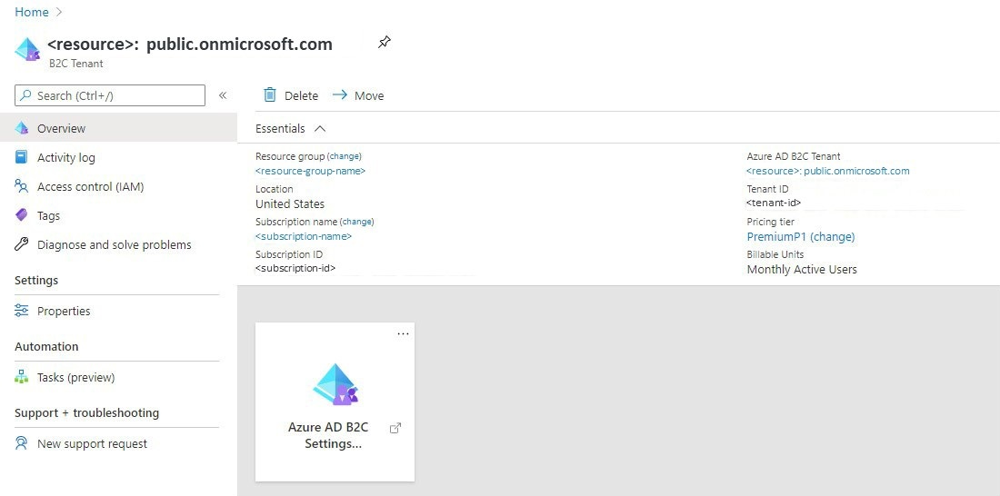

2. Once the resource was created, [**create a new user-flow**](https://docs.microsoft.com/en-us/azure/active-directory-b2c/tutorial-create-user-flows).

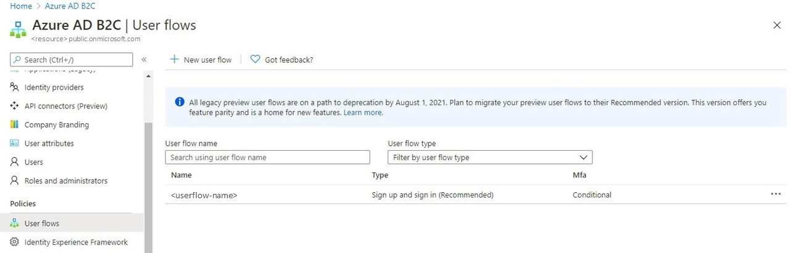

3. When the “user-flow” is ready you will be able to link Identity Providers (such as Facebook, GitHub, Microsoft,
   Google, LinkedIn, and others) following the steps detailed
   [**here**](https://docs.microsoft.com/en-us/azure/active-directory-b2c/add-identity-provider).

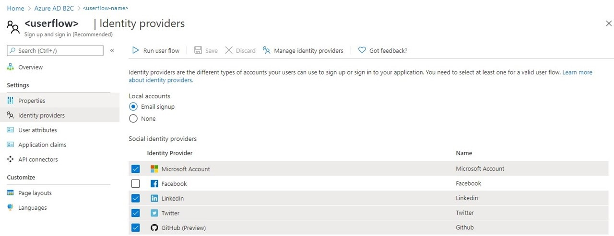

### Customizing

Azure AD B2C provide the feature to customize the login page. To achieve this customization you need to activate the option "Use custom page content" of the "Unified sign up or sign in page" layout in the "Customize" section in the previously created "User Flow".

To simplify this task, we downloaded and customized a template from the repository [Azure-AD-B2C-page-templates](https://github.com/Azure-Samples/Azure-AD-B2C-page-templates):

```bash
git clone https://github.com/Azure-Samples/Azure-AD-B2C-page-templates
```

Once modified the template, we placed it in a read-only [Blob Storage](#others-storage-support-accounts) and set "Custom Page URL".

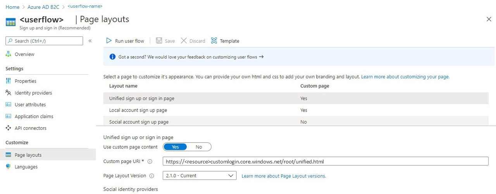

The result is a custom login page.

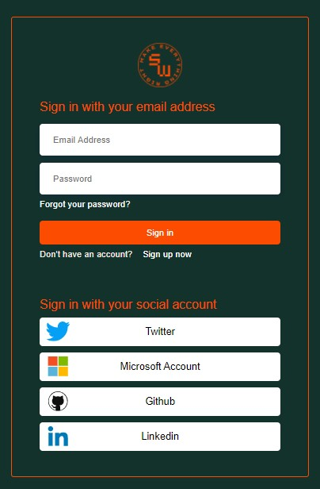

<p>
<br/>
<br/>
</p>

## App Service

The App Service of type Web Application, provide the environment to publish the Web Application. You can learn more about Azure App Services consulting the [official documents](https://docs.microsoft.com/en-us/azure/app-service/)

### Deploy ARM template

Browse to the **[deployment-templates/app-service](../../deployment-templates/app-service)** folder and in the **[template-app-service.json](../../deployment-templates/app-service/template-app-service.json)** template file replace the default values of the parameters with the values of your election.

```json
"sites_web_application_name": {
    "defaultValue": "<b2capp>",
    "type": "String"
},
"serverfarms_service_plan_externalid": {
    "defaultValue": "<service-plan-resource-id>",
    "type": "String"
}
```

| Parameter                           | Description                                                                                                  |
| ----------------------------------- | ------------------------------------------------------------------------------------------------------------ |
| sites_web_application_name          | Replace defaultValue: **\<b2capp\>** with your preferred App Service name.                                   |
| serverfarms_service_plan_externalid | Replace defaultValue: **\<service-plan-resource-id\>** with your previously chosen Service Plan resource id. |

> _Note:_ To find the resource ID of the App Service Plan, you will need to search for the desired service plan in your Azure resource group and, once there, get it in the "Properties" section.
> 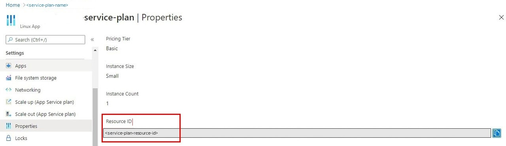

Once the template is ready, deploy it using the command:

```bash
New-AzResourceGroupDeployment -ResourceGroupName $resourceGroupName -TemplateFile template-app-service.json
```

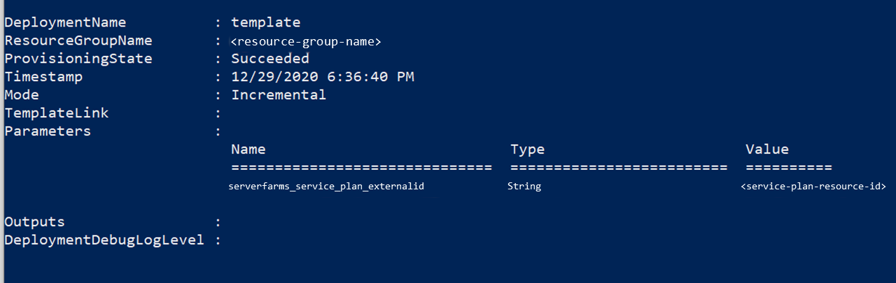

<p>
<br/>
<br/>
</p>

## Configure Application to Embedding Reports

Embedding Power BI reports into an app with custom authentication can be tricky, but it's perfectly doable with a Master Account or Service Principal. For this project, we prefer to use a Service Principal, but the Web API also accepts credentials for working with a Master Account. You can find a very good explanation on how to embed Power BI in a "Customer Application" [here](https://docs.microsoft.com/en-us/power-bi/developer/embedded/embed-sample-for-customers?tabs=net-framework).

Also note the following steps that are not available in the official documents.

### Application Permissions

When the application is created in Azure AD, you must provide some permissions, the steps are the followings:

1. Go to "API Permissions" in the left menu on your Azure AD application.
   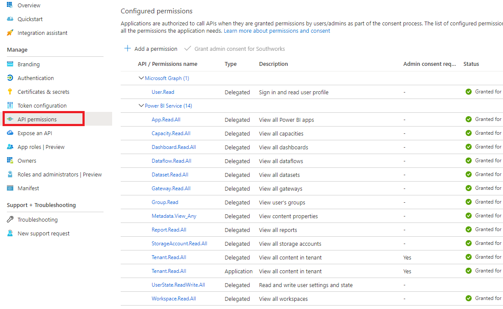

2. Select "Add Permissions" option.
   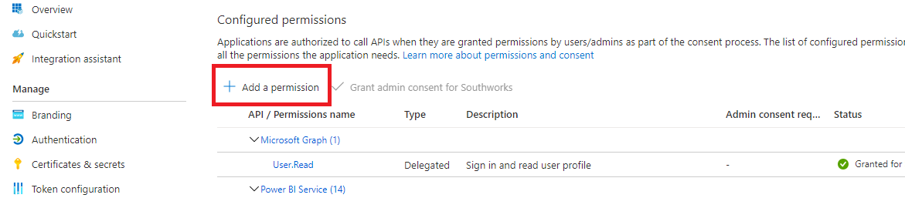

3. Select "Power BI Services".
   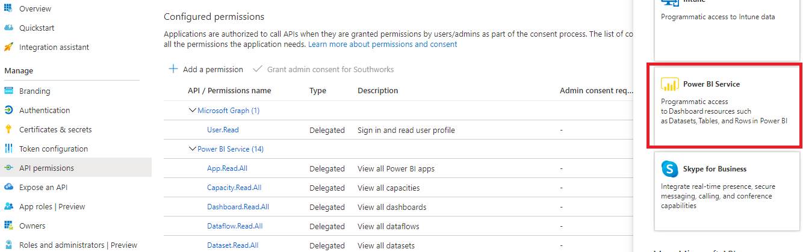

4. Select the required permissions (we only settled permissions to read, but you can assign as well permissions to write).
   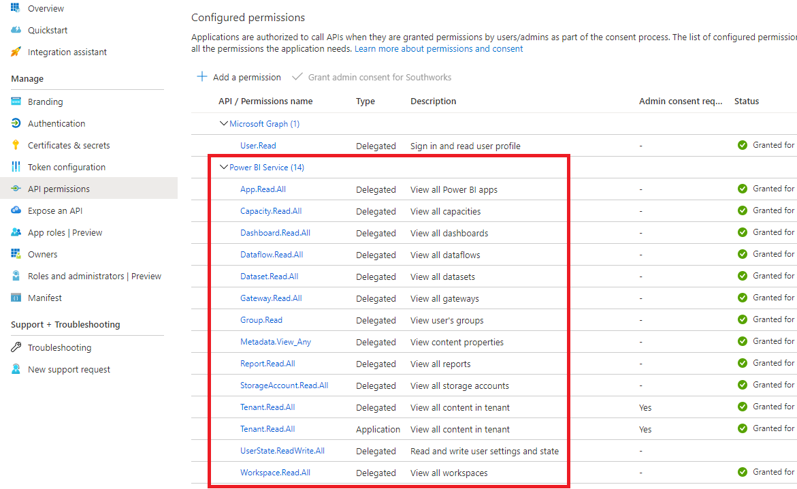

### Power BI Service Principal registration

You must enable the setting ["Allow service principals to use Power BI APIs"](https://docs.microsoft.com/en-us/power-bi/developer/embedded/embed-service-principal#step-3---enable-the-power-bi-service-admin-settings) in the admin portal because this feature is not enabled by default.

Also, you need to register your Service Principal application in your Power BI Workspace make sure that you select the "Admin" role, to do it follow this steps:

1. Go to Power BI web and Sign-in.

2. Select option "Workspace access" of the desired workspace, clicking in the 3 dots dropdown menu.
   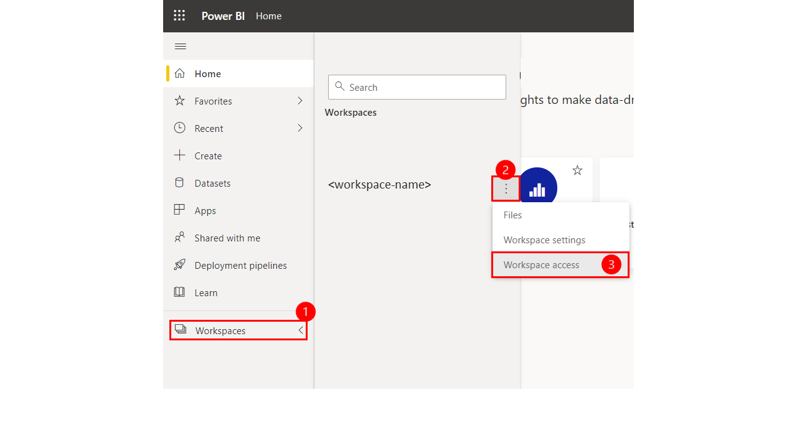

3. Enter the name of your Service Principal application (when all the permissions are settled properly Power BI automatically detect the application as a Service Principal), and give to it the role "Admin".
   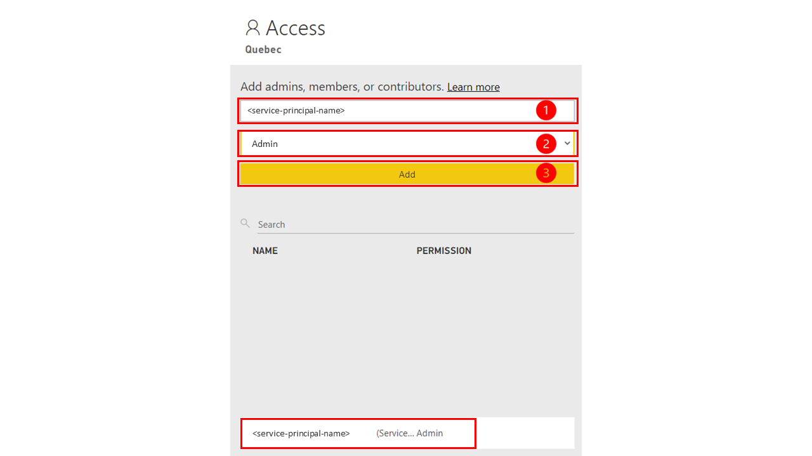

<p>
<br/>
<br/>
</p>

## Deploy B2C WebApp Into Azure App Service

We used Microsoft Visual Studio 2019 to deploy the code directly in Azure App Service, this is a very straightforward operation if you follow the next steps.

### Configure and build ReactJS client App

Browse to the **[EmbedForCustomers/Client_B2C](EmbedForCustomers/Client_B2C)** folder and in the **[.env.production](EmbedForCustomers/Client_B2C/.env.production)** environment file replace the values of the properties with the values of your election.

 ```
REACT_APP_TENANT = '<aad-b2c-tenant-name>.onmicrosoft.com'
REACT_APP_POLICY = '<aad-b2c-userflow-name>'
REACT_APP_APPLICATION_ID = '<aad-b2c-app-id>'
REACT_APP_REDIRECT_URI = '<site-base-url>'
REACT_APP_API_ENDPOINT = '<site-base-url>/api'
REACT_APP_ENV = 'prod'
```

| Property                  | Description                                                                                                                                     |
| ------------------------- | ----------------------------------------------------------------------------------------------------------------------------------------------- |
| REACT_APP_TENANT          | Replace value: **\<aad-b2c-tenant\>** with your Azure AD B2C tenant name.                                                                           |
| REACT_APP_POLICY          | Replace value: **\<aad-b2c-userflow-name\>** with your Azure AD B2C user flow name.                                                                 |
| REACT_APP_APPLICATION_ID  | Replace value: **\<aad-b2c-app-id\>** with your Azure AD B2C application ID.                                                                       |
| REACT_APP_REDIRECT_URI    | Replace value: **\<site-base-url\>** with your App Service web base-URL.                                                                            |
| REACT_APP_API_ENDPOINT    | Replace value: **\<site-base-url\>** with your App Service web base-URL.                                                                            |

Once edited the environment file, browse to the **[EmbedForCustomers/Client_B2C/src/app/common/options](EmbedForCustomers/Client_B2C/src/app/common/options)** folder and in the **[reportsOptions.ts](EmbedForCustomers/Client_B2C/src/app/common/options/reportsOptions.ts)** file replace the values of the properties with the values of your election.

```
    showPages: <power-bi-pagination>,
    title: "<custom-report-title>",
    id: "<power-bi-report-id>",
    description: "<custom-report-description>"
```

| Property    | Description                                                                                                                                                                                           |
| ------------| ----------------------------------------------------------------------------------------------------------------------------------------------------------------------------------------------------- |
| showPages   | Replace value: **\<power-bi-pagination\>** with your "_true_" if you want to see pages in your report or "_false_" in the opposite case (a default value is already setled for this application reports). |
| title       | Replace value: **\<custom-report-title\>** with your preferred title for the report (a default value is already setled for this application reports).                                                     |
| id          | Replace value: **\<power-bi-report-id\>** with the current report ID in Power BI (follow steps detailed [here](https://docs.microsoft.com/en-us/power-bi/developer/embedded/embed-sample-for-customers?tabs=net-core#report-id)). |
| description | Replace value: **\<custom-report-description\>** with your preferred title for the report (a default value is already setled for this application reports).                                               |

Save all your changes and run the following commands:

```bash
npm install && npm build:production
```

### Configure backend API

Browse to the **[EmbedForCustomers](EmbedForCustomers)** folder and in the **[appsettings.json](EmbedForCustomers/appsettings.json)** settings file replace the values of the properties with the values of your election.

> We recommend to use as guide this [document](https://docs.microsoft.com/en-us/power-bi/developer/embedded/embed-sample-for-customers?tabs=net-core#step-5---get-the-embedding-parameter-values).

```json
"AzureAd": {
    "AuthenticationMode": "<authentication-mode>",
    "AuthorityUri": "https://login.microsoftonline.com/organizations/",
    "ClientId": "<application-id>",
    "TenantId": "<service-principal-tenant-id>",
    "Scope": [ "https://analysis.windows.net/powerbi/api/.default" ],
    "PbiUsername": "<master-account-username>",
    "PbiPassword": "<master-account-password>",
    "ClientSecret": "<service-principal-client-secret>"
},
"PowerBI": {
    "WorkspaceId": "<powerbi-workspace-id>"
},
```

| Property           | Description                                                                                                                                     |
| ------------------ | ----------------------------------------------------------------------------------------------------------------------------------------------- |
| AuthenticationMode | Replace value: **\<authentication-mode\>** with your preferred authentication mode (_"ServicePrincipal"_ or _"MasterUser"_).                    |
| ClientId           | Replace value: **\<application-id\>** with your registred application id (follow steps detailed [here](https://docs.microsoft.com/en-us/power-bi/developer/embedded/embed-sample-for-customers?tabs=net-core#client-id)).                               |
| TenantId           | Replace value: **\<service-principal-tenant-id\>** with your Service Principal GIUD id (follow steps detailed [here](https://docs.microsoft.com/en-us/power-bi/developer/embedded/embed-sample-for-customers?tabs=net-core#tenant-id)).                               |
| PbiUsername        | Replace value: **\<master-account-username\>** with your Master Account user name (follow steps detailed [here](https://docs.microsoft.com/en-us/power-bi/developer/embedded/embed-sample-for-customers?tabs=net-core#power-bi-username-and-password)).          |
| PbiPassword        | Replace value: **\<master-account-password\>** with your Master Account password (follow steps detailed [here](https://docs.microsoft.com/en-us/power-bi/developer/embedded/embed-sample-for-customers?tabs=net-core#power-bi-username-and-password)).          |
| ClientSecret       | Replace value: **\<service-principal-client-secret\>** with your Service Principal secret key (follow steps detailed [here](https://docs.microsoft.com/en-us/power-bi/developer/embedded/embed-sample-for-customers?tabs=net-core#client-secret)).|
| WorkspaceId        | Replace value: **\<powerbi-workspace-id\>** with the Power BI worspace which contains the reports to embed (follow steps detailed [here](https://docs.microsoft.com/en-us/power-bi/developer/embedded/embed-sample-for-customers?tabs=net-core#workspace-id)). |


### Publish project into Azure App Service.

We used Visual Studio 2019 to publish the project in the previously created Azure App Service. So, using Visual Studio 2019 the steps are as follows:

1. Open **[EmbedForCustomers.sln](EmbedForCustomers/EmbedForCustomers.sln)** solution in Microsoft Visual Studio 2019.

2. In Visual Studio 2019 browse to "Build" menu and select "Publish EmbedForCustomers" option or right click over the project in the "Solution Explorer" and select "Publish" item.

    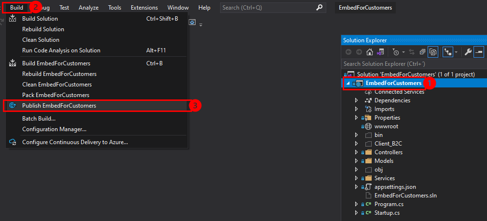

3. Click on “Start” button.

    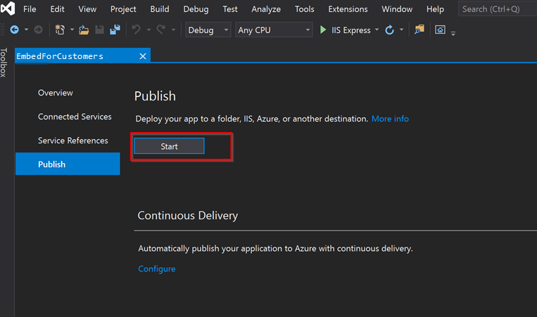

4. Select Azure App Service (Linux) and press “Create profile”.

    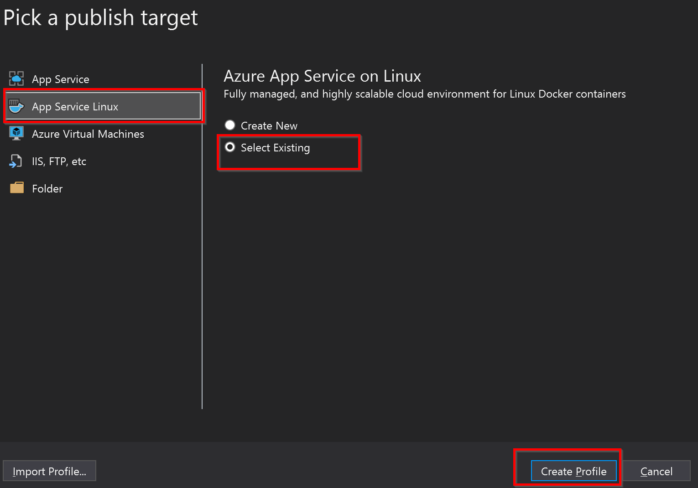

5. Select you App Service and press “Ok”.

    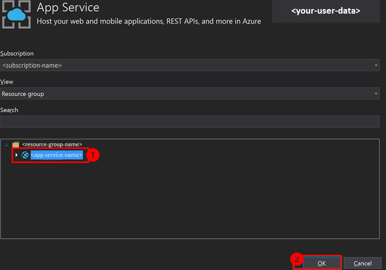

6. Change and check “Target Framework”, “Deployment Mode” and “Target Runtime”.

    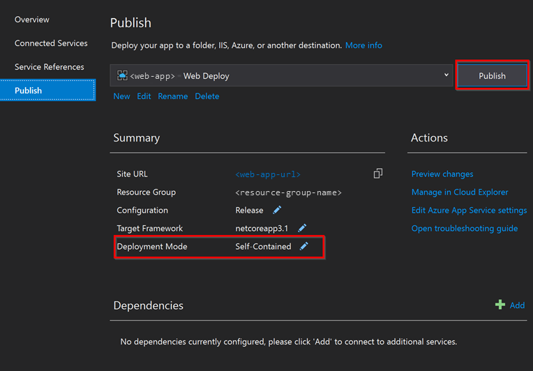

7. Press “Publish” button and wait until process finish.

    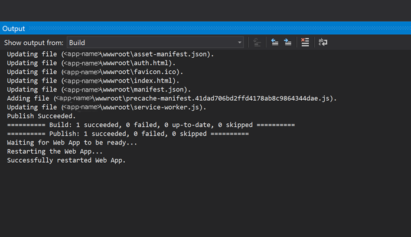

8. Deploy **wwwroot** folder into Azure App Service.

    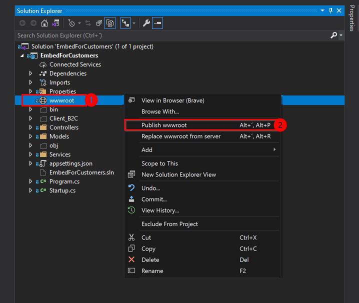

    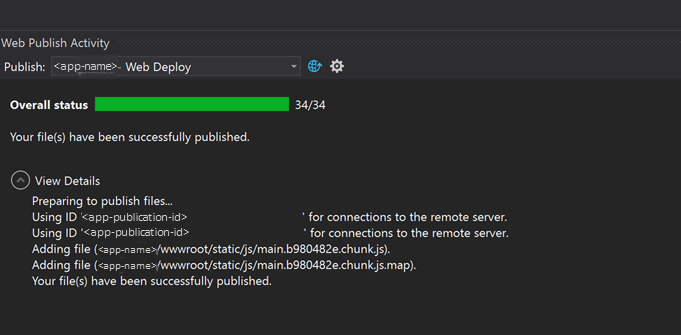
