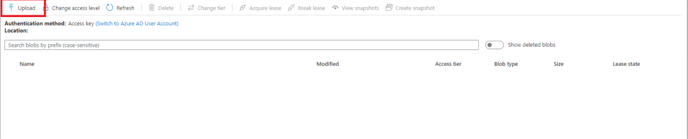
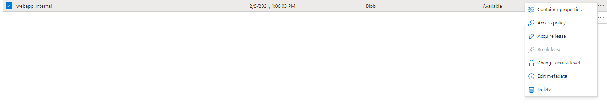

## Overview

This application demonstrates how to embed Power BI reports for users inside our organization.

We used [Azure Active Directory B2B](https://docs.microsoft.com/en-us/azure/active-directory/external-identities/what-is-b2b) to authenticate users and collect the auth-token required to embed the reports from Power BI.

## Contents

[Requirements](#requirements)

[Folder Structure](#folder-structure)

[Web App Deploy](#web-app-deploy)

[Run Web App Locally](#run-locally)

## Requirements

In order to test and deploy our solution, you will need the following:

1. An active Azure subscription.
2. A Resource Group inside de Azure subscription.
3. A Storage Account inside the Resource Group.
4. [NodeJS and npm](https://nodejs.org/en/) (necessary to install the packages of the applications), we recommend NodeJS 12 or higher.
5. (Optional) An IDE can be handy, we recomend [Visual Studio Code](https://code.visualstudio.com/download).

## Folder Structure

 ```
(embed-for-organization)
├── EmbedForOrganization
|   ├── public   
|   └── src
|       ├── app
|       |   ├── common
|       |   ├── components
|       |   ├── config
|       |   └── layout
|       └── template
|           ├── assets
|           ├── components
|           └── views
└── images
```

<ul>
    <li>
        <b>public</b>: Contains the page template (index.html) and its dependencies (index.css).
    </li>
    <li>
        <b>src</b>: Contains all the web app resources files
        <ul>
            <li>
                <b>app</b>: Contains all the components necessary to run the font web page 
                <ul>
                    <li>
                        common: Contains all the common files used on the different files of the project
                    </li>
                    <li>
                        components: Contains the containers that uses the views of the template
                    </li>
                    <li>
                        config: Contains files which provide and manage the configurations of the reports, Azure and
                        PowerBI ID's
                    </li>
                    <li>
                        layout: Contains visual components which visually layout the web page
                    </li>
                </ul>
            </li>
            <li>
                <b>template</b>: Contains all the components necessary to run the front web page
                <ul>
                    <li>
                        <b>assets</b>: Contains all the resources like images, css, jss, sounds, etc.
                    </li>
                    <li>
                        <b>components</b>: Contains all the components which help to build the views of the web app
                    </li>
                    <li>
                        <b>views</b>: Contains all the views used on the web app
                    </li>
                </ul>
            </li>
        </ul>
    </li>
</ul>
<br>

## Web App Deploy

To deploy the web app, you have to create the Azure ID for Power BI embed reports, click <a href="https://docs.microsoft.com/en-us/power-bi/developer/embedded/register-app?tabs=organization%2CAzure#register-an-azure-ad-app">here</a>
to see how to create.

### Install npm dependencies

To install all the project dependencies make sure that you had <a href="https://www.npmjs.com/" target="_blank">npm</a> 
installed, then open a terminal on the root path of the project and run  

``` bash
npm install -S
```

### Configure files

In the **[Config.js](EmbedForOrganization/src/app/config/Config.js)**
Replace the `"your-aad-application-id"` with your Azure Active Directory ID, also replace `"powerbi_workspace_id"`
with the id of the workspace where the reports are hosted in Power BI.

```javascript
// Client Id (Application Id) of the AAD app.
export const clientId = "your-aad-application-id";

// Id of the workspace where the report is hosted
export const workspaceId = "powerbi_workspace_id";
```
To get your Power BI workspace ID, go to **Azure Portal > Active Directory > Groups**, click the group name.


> Highlighted in red **Object Id** that corresponds with the **Workspace Id** in in Power BI.

Finally replace each object of the reports array with their related report

```javascript
  report_name: {
    title: "title_of_the_report",
    id: "id_of_the_report",
    description: "description_of_the_report",
    showPages: true
  }
```
| Property    	| Description                                                                                                              	|
|-------------	|--------------------------------------------------------------------------------------------------------------------------	|
| title       	| Title that will be displayed in the application.                                                                         	|
| id          	| Power BI report id.                                                                                                      	|
| description 	| Description that will be displayed in the application.                                                                   	|
| showPages   	| (boolean) If a report contains more than one page, use this property to indicate whether (true) or not (false) you want to display them.
<p>
<br>
</p>

The easiest way to know ```id_of_the_report``` is to look at its URL, for example, open some report in [app.powerbi.com](https://app.powerbi.com) and look at the address bar:

```
https://app.powerbi.com/groups/<workspace id>/reports/<id_of_the_report>/ReportSection
```

This is the only configuration file that the project needs.

### Build WebApp

To build the WebApp, make sure that the project [run locally](#run-locally) and then, build the app with `npm run build`, if the
build completed successfully you should see the something like:<br>
 <br><br>
A new folder will create on the root path named `build` <br>
<pre>
EmbedForOrganization
<b>├─── build</b>   
├─── public   
└─── src
</pre>

### Publish WebApp

To publish the WebApp you should [create a build](#build-webapp) previously and follow the next steps:
<ol>
<li>
Go to <a href="https://portal.azure.com/" target="_blank">Azure</a>, enter to your resource group and select 
the Storage Account
</li>
<li>
Create a new container inside the storage account selected that will contains the WebApp
</li>
<li>
Inside the container created select <b>upload</b> 
</li>



<li>
Open the path where are located the project and select all the files and folders created under the <b>build</b> folder
that is under the root project folder and click on <b>upload</b> button.
</li>
<li>To see your WebApp published you need to set the container as public, so anyone who access to the link can see it.
Follow the next steps to make it public:
<br>
Select the Webapp Container and click on the three dots on the right side, then select change access level
<br><br>



<br><br>
Then choose Blob
<br><br>

<br>
<br>

</li>
<li>
Finally, enter to the container and click to the <b>index.html</b> file, you will see a side container with a field <b>URL</b>, copy it and there is the Web App deployed.
<br><br>


</li>
</ol>

## Run locally

To run the Web App locally you must [install npm dependencies](#install-npm-dependencies) and then [configure files](#configure-files). Once you finished run in terminal:

```bash
npm start
```

Once npm complete the process you should see something like this: <br><br>

